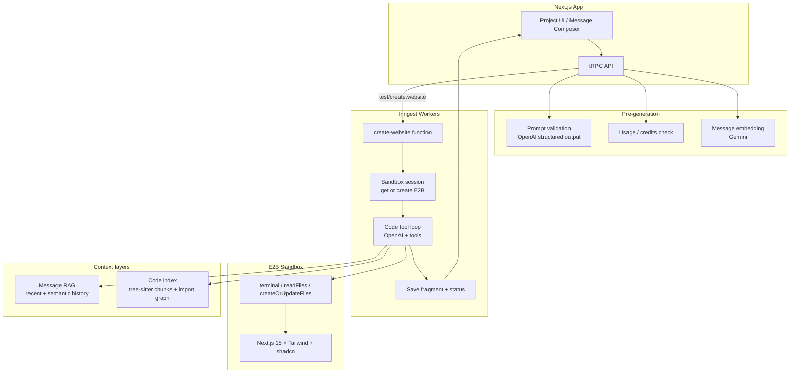

# Vibe

AI-powered website builder that turns natural-language prompts into live Next.js applications. Users describe what they want; the system validates the request, runs code generation inside an isolated E2B sandbox, and returns a previewable app with versioned file snapshots.

## Overview

Vibe is a full-stack Next.js app with:

- **Prompt → preview pipeline** — validate, generate, persist fragments, show a live sandbox URL
- **Iterative editing** — follow-up messages edit the existing project with grounded file context
- **Durable background jobs** — Inngest orchestrates sandbox lifecycle and the coding loop
- **Usage-based billing** — free and Pro tiers with Razorpay checkout

The coding path uses a **single OpenAI tool-calling loop** (not a multi-agent network). Prompt validation, embeddings, and fragment titling are separate lightweight steps around that core loop.

## Architecture




## Request flow


### New project

1. User submits a prompt on the home page.
2. `projects.create` checks usage credits, validates the prompt, embeds the message, creates the project, and emits `test/create.website`.
3. The Inngest `create-website` function runs the code tool loop in **fresh mode** (no prior files).
4. On success, an assistant `RESULT` message and `Fragment` (title, files, sandbox URL) are saved; generation status returns to `IDLE`.


### Follow-up edit

1. User sends another message in an existing project via `messages.create`.
2. The worker loads the latest active fragment files, prior chat via message RAG, and reuses the project's E2B sandbox when possible.
3. The loop runs in **edit mode**: current file contents are inlined into the prompt so the model edits from ground truth.
4. A new fragment is created; older fragments are marked `disabled`.


### Retry

When generation fails or is cancelled, status becomes `FAILED` or `CANCELLED`. The UI offers retry, which re-sends the last user prompt with `retry: true` without creating a duplicate user message.

## Code generation


### Tool loop (`runCodeToolLoop`)

The core agent is an OpenAI chat completion with function tools, executed inside durable Inngest steps:


| Tool                  | Purpose                                  |
| --------------------- | ---------------------------------------- |
| `terminal`            | Shell commands (npm install, shadcn CLI) |
| `readFiles`           | Read sandbox files before editing        |
| `createOrUpdateFiles` | Write or replace files                   |


**Models** (configurable via `MODEL_CODE`, `MODEL_PROMPT_VALIDATION`):


| Role              | Default (non-prod)         | Provider | Prod (`APP_MODE=prod`)                            |
| ----------------- | -------------------------- | -------- | ------------------------------------------------- |
| Code              | `gpt-4.1` → `gpt-4.1-mini` | OpenAI   | `gemini-2.5-pro` → `gemini-2.5-flash` (user BYOK) |
| Prompt validation | `gpt-4.1-mini` → `gpt-4.1` | OpenAI   | `gemini-2.5-flash` → `gemini-2.5-pro` (user BYOK) |
| Embeddings        | `gemini-embedding-001`     | Gemini   | Same models via user Gemini key                   |


The system prompt (`src/prompt.ts`) combines sandbox rules (`src/prompts/sandbox-code.ts`) with shadcn usage guidance (`src/prompts/shadcn-skill.ts`). At loop start, `loadShadcnContext` runs `npx shadcn@latest info --json` in the sandbox and injects component docs for anything referenced in the user prompt.

The model finishes by emitting a `<task_summary>...</task_summary>` block. That text becomes the assistant message, and `sanitizeFragmentTitle` derives a short fragment card title.

**Resilience:**

- Up to 15 infer/tool iterations per run
- Model fallback chain when a model fails before producing output
- Mid-stream rate-limit handling: partial file args are salvaged, checkpointed to the sandbox, then the same model continues after `step.sleep`
- Empty results and hard failures produce `RETRY` assistant messages with structured `errorDetails`


### Sandbox (`E2B_SANDBOX_TEMPLATE = vibe-three`)

Each project gets a persistent E2B sandbox (auto-pause on timeout):

- Next.js 15.5.2, Tailwind CSS, shadcn/ui (Radix, New York preset)
- Dev server already running on port 3000
- Template defined in `sandbox-templates/nextjs/e2b.Dockerfile`

Sandbox sessions are stored on `Project.sandboxId`. When a sandbox is recreated, fragment files are hydrated back into it before coding resumes.

## Context and retrieval


### Message RAG (`src/lib/message-context.ts`)

For edit and continuation runs, chat history is trimmed intelligently:

- Always keep the last 2 messages (anchor)
- Pull up to 4 older messages by cosine similarity to the current prompt (threshold 0.7)
- Hard cap of 6 messages total

Messages are embedded with Gemini on write; missing embeddings are backfilled lazily.

### Code intelligence (`src/lib/code-index.ts`, `src/lib/code-retrieve.ts`)

For larger codebases, the project maintains a searchable code index:

- **Chunking** — AST-aware splits via web-tree-sitter / LlamaIndex `CodeSplitter`, with line-window fallback
- **Embeddings** — per-chunk vectors stored in `CodeChunk`
- **Import graph** — madge-derived `IMPORTS` edges in `CodeEdge`
- **Hybrid retrieval** — keyword path scoring + vector similarity, with 1-hop graph expansion

Edit runs currently inline file contents directly (up to ~48k chars). The code index layer is available for semantic retrieval on large projects and is covered by unit tests in `src/lib/code-retrieval.test.ts`.

## API surface

tRPC routers (`src/trpc/routers/_app.ts`):


| Router     | Responsibility                                                   |
| ---------- | ---------------------------------------------------------------- |
| `projects` | Create project, list, get one (with generation status reconcile) |
| `messages` | List messages + fragments, send follow-up / retry                |
| `usage`    | Credit balance and consumption                                   |
| `billing`  | Pro plan checkout (Razorpay), coupons, plan status               |


Auth is enforced via Better Auth (Google OAuth) and session cookies. Protected routes redirect unauthenticated users to `/sign-in`.

## Data model

Key Prisma models:

- **User** — `plan` (`FREE` / `PRO`), `planExpiresAt`, optional `couponCode`
- **Project** — `generationStatus`, `sandboxId`, `sandboxUrl`, `inngestEventId`
- **Message** — `USER` / `ASSISTANT`, `RESULT` / `RETRY`, optional `embedding` and `errorDetails`
- **Fragment** — snapshot of `files` (JSON), `sandboxUrl`, `title`; older fragments disabled on new success
- **CodeChunk / CodeEdge** — per-project code index
- **Usage** — rate-limiter points store (2 credits/month free, 100/month Pro)
- **Payment** — Razorpay order tracking


## Tech stack


| Layer        | Choices                                                      |
| ------------ | ------------------------------------------------------------ |
| Frontend     | Next.js 15 (App Router), React 19, Tailwind CSS 4, shadcn/ui |
| API          | tRPC 11, Zod, SuperJSON                                      |
| Auth         | Better Auth + Google OAuth                                   |
| Database     | PostgreSQL + Prisma                                          |
| Jobs         | Inngest (dev server or cloud)                                |
| Sandbox      | E2B Code Interpreter                                         |
| LLM          | OpenAI Chat Completions (code + validation)                  |
| Embeddings   | Gemini Embedding API                                         |
| Billing      | Razorpay                                                     |
| Code parsing | web-tree-sitter, LlamaIndex CodeSplitter, madge              |


## Project structure

```
src/
├── app/                    # Next.js routes (home, project, auth, API)
├── components/             # Shared UI (code view, file explorer, shadcn)
├── inngest/
│   ├── functions.ts        # create-website + failure/cancel handlers
│   ├── code-tool-loop.ts   # OpenAI tool-calling loop
│   ├── sandbox-tools.ts    # E2B tool implementations
│   └── sandbox.ts          # Sandbox lifecycle
├── lib/
│   ├── code-*.ts           # Chunking, indexing, retrieval, graph
│   ├── embeddings.ts       # Gemini embeddings
│   ├── message-context.ts  # Chat RAG
│   └── project-queries.ts  # DB helpers for generation flow
├── modules/
│   ├── projects/           # Project UI + tRPC
│   ├── messages/           # Message tRPC
│   ├── billing/            # Razorpay + plans
│   └── validation/         # Prompt validation
├── prompts/                # System prompt sections
└── trpc/                   # tRPC setup and routers
```


## Getting started


### Prerequisites

- Node.js 20+
- PostgreSQL database
- API keys: OpenAI, E2B, Better Auth secret, Google OAuth
- Optional: Gemini (embeddings), Razorpay (billing), Inngest Cloud keys (production)


### Setup

```bash
npm install
cp .env.example .env
# Fill in DATABASE_URL, OPENAI_API_KEY, E2B_API_KEY, BETTER_AUTH_*, GOOGLE_*, etc.
npx prisma db push
```


### Environment variables


| Variable                                    | Required   | Purpose                                                           |
| ------------------------------------------- | ---------- | ----------------------------------------------------------------- |
| `DATABASE_URL`                              | Yes        | PostgreSQL connection                                             |
| `OPENAI_API_KEY`                            | Non-prod   | Code generation and prompt validation (when `APP_MODE` ≠ `prod`)  |
| `E2B_API_KEY`                               | Yes        | Sandbox creation                                                  |
| `BETTER_AUTH_SECRET`                        | Yes        | Session signing                                                   |
| `BETTER_AUTH_URL`                           | Yes        | Auth base URL (e.g. `http://localhost:3000`)                      |
| `GOOGLE_CLIENT_ID` / `GOOGLE_CLIENT_SECRET` | Yes        | Google sign-in                                                    |
| `NEXT_PUBLIC_APP_URL`                       | Yes        | Public app URL for tRPC client                                    |
| `GEMINI_API_KEY`                            | Non-prod   | Embeddings when not using per-user BYOK                           |
| `APP_MODE`                                  | Optional   | Set to `prod` to require per-user Gemini BYOK for generation      |
| `ENCRYPTION_KEY`                            | Prod BYOK  | Required when `APP_MODE=prod` — encrypts user Gemini keys at rest |
| `INNGEST_DEV`                               | Local dev  | Set to `1` to use the Inngest dev server                          |
| `INNGEST_BASE_URL`                          | Local dev  | Default `http://localhost:8288`                                   |
| `INNGEST_EVENT_KEY` / `INNGEST_SIGNING_KEY` | Production | Inngest Cloud                                                     |
| `RAZORPAY_KEY_ID` / `RAZORPAY_KEY_SECRET`   | Optional   | Pro plan checkout                                                 |
| `MODEL_CODE` / `MODEL_PROMPT_VALIDATION`    | Optional   | Override model chains                                             |


### Development

Run the Next.js app and Inngest dev server in separate terminals:

```bash
npm run dev
npm run inngest
```

After `npm install`, Husky installs Git hooks automatically via the `prepare` script.

### Git hooks


| Hook         | Runs                                                 | Purpose                                                              |
| ------------ | ---------------------------------------------------- | -------------------------------------------------------------------- |
| `pre-commit` | `lint-staged` → ESLint `--fix` on staged JS/TS files | Fast local gate before each commit                                   |
| `commit-msg` | `commitlint`                                         | Enforce [Conventional Commits](https://www.conventionalcommits.org/) |
| `pre-push`   | `typecheck` + `test`                                 | Catch type and unit-test failures before remote push                 |


Commit messages must look like `type(scope): subject`, for example:

```text
feat: add commit message validation
fix(auth): handle expired sessions
chore: bump dependencies
```

Allowed types include `feat`, `fix`, `docs`, `style`, `refactor`, `perf`, `test`, `build`, `ci`, `chore`, and `revert`.

Run the full local suite anytime with `npm run check` (`lint` + `typecheck` + `test`).

### Scripts


| Command                         | Description                                 |
| ------------------------------- | ------------------------------------------- |
| `npm run dev`                   | Next.js dev server (Turbopack)              |
| `npm run inngest`               | Inngest dev server                          |
| `npm run build`                 | Production build                            |
| `npm run lint`                  | ESLint across the repo                      |
| `npm run lint:fix`              | ESLint with auto-fix                        |
| `npm run typecheck`             | TypeScript check                            |
| `npm run test`                  | Unit tests (code retrieval, shadcn context) |
| `npm run check`                 | lint + typecheck + test                     |
| `npm run sync:tree-sitter-wasm` | Sync tree-sitter WASM assets                |


## Security

- **Sandbox isolation** — code runs in E2B with network/filesystem boundaries
- **Auth gating** — middleware protects project routes; tRPC uses `protectedProcedure`
- **Prompt validation** — rejects non web-build requests before generation
- **Usage limits** — per-user credit consumption via `rate-limiter-flexible`
- **Webhook verification** — Razorpay signatures validated on payment events

